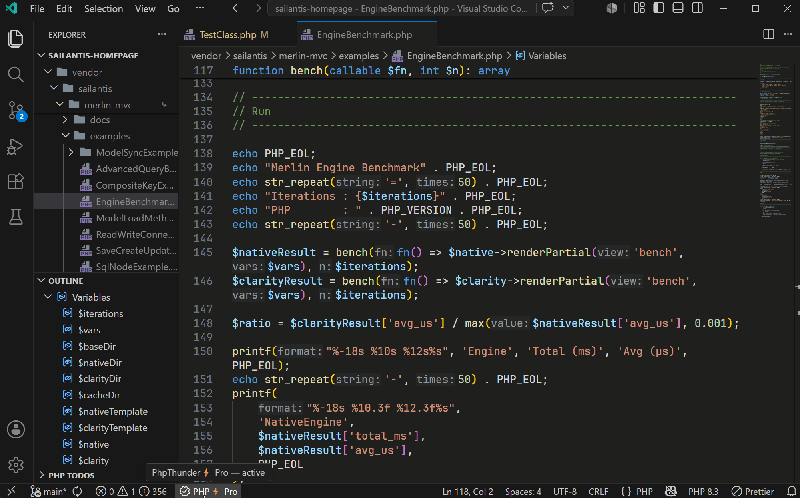

# Getting started

Welcome to PhpThunder, a PHP language server, debugger, and workflow extension for VS Code. This quick start covers the shortest path from installation to the first useful result.

## What is needed

| Requirement  | Why it matters                                                   |
| ------------ | ---------------------------------------------------------------- |
| VS Code      | The extension host                                               |
| A PHP binary | Required for debugging, tests, profiling, and Composer tasks     |
| Xdebug       | Required for debugging and profiling                             |
| Composer     | Required when the project uses `vendor/` packages or autoloading |

Code intelligence, diagnostics, and formatting work as soon as the extension activates. A fully configured PHP binary is not required for the first scan.

## First run

Follow these steps the first time a PHP project is opened with PhpThunder:

1. Install the extension from the VS Code marketplace.
2. Open the project folder that contains the PHP sources.
3. Run `PhpThunder: Select PHP Version` and choose the version the project targets.
4. Run `PhpThunder: Configure PHP Interpreters` when a specific PHP binary is needed. If the system `php` is already correct, this step can wait.
5. Open a PHP file and let the initial scan finish.
6. Run `PhpThunder: Reindex Workspace` if you encounter issues after making changes via Composer, or regarding include path settings or the workspace structure in general.

> **Tip:** When the project uses Composer, run `composer install` before opening the folder so `vendor/` symbols are available from the first scan.

## What should appear

Once the initial index is complete, the editor should show:

- **Completion** for classes, functions, constants, members, imported namespaces, and PHPDoc-backed types such as templates, array shapes, aliases, and callback parameters
- **Hover documentation** for symbols and inferred types, including PHPDoc from dependencies and higher-order callback inference
- **Diagnostics** for syntax errors, type mismatches, array-shape key issues, and selected PHPDoc issues
 - **Import assistance** that suggests and inserts `use` statements for unresolved short names
 - **Test Explorer entries** when PHPUnit or Pest tests exist in the standard locations
 - **Todo treeview** that displays project-specific Todo items and related quick actions
 - **A status-bar entry** showing the current access state (Free, Trial, or Pro)

## Commands worth memorizing

- `PhpThunder: Select PHP Version` — sets the language level for the current folder
- `PhpThunder: Configure PHP Interpreters` — adds and manages PHP binaries
- `PhpThunder: Reindex Workspace` — rebuilds the project index after structural changes

For the detailed setup path, including Composer, include paths, and licensing, see [Installation and activation](02-installation-and-activation.md).

## When to reindex

Run `PhpThunder: Reindex Workspace` after:

- running `composer install` or `composer update`
- adding or changing `phpThunder.includePaths`
- switching the PHP version setting for the folder
- moving or renaming a large number of files outside the editor

Most single-file changes are picked up automatically. Reindex is for changes that affect the whole project graph.

## Next steps

- [Installation and activation](02-installation-and-activation.md) — detailed workspace setup and activation
- [Editor features](03-editor-features.md) — day-to-day editing workflows in detail
- [Debugging](04-debugging.md) — Xdebug setup and launch configurations
