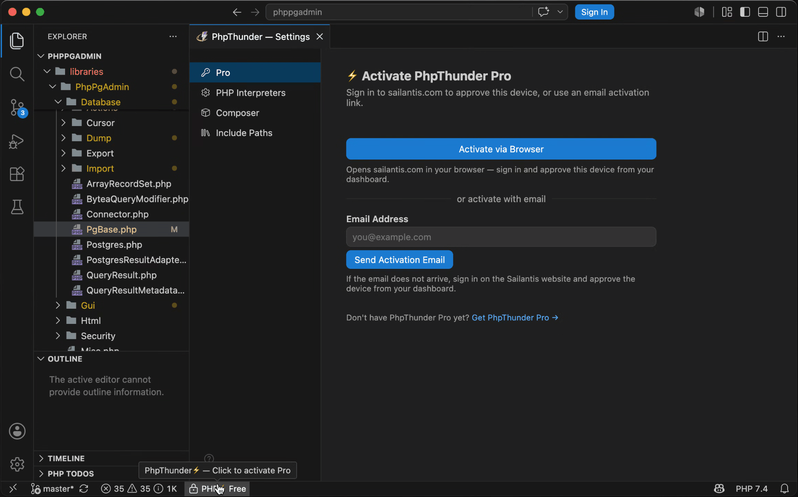
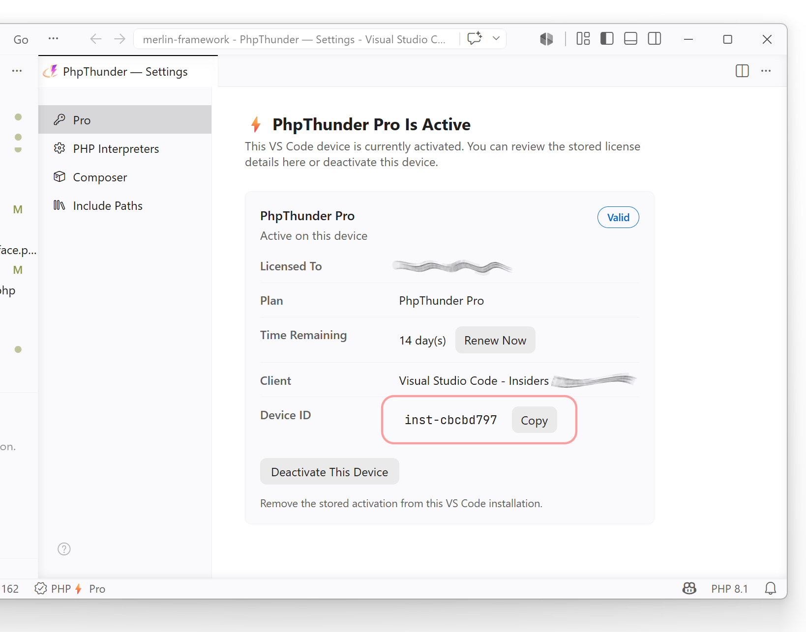

# Installation and activation

This guide covers the full setup path for PhpThunder: installing the extension, selecting the PHP interpreter, tuning workspace settings, and activating a license when Pro workflows are needed.

## Install the extension

PhpThunder can be installed in two ways:

### Option 1: VS Code Marketplace (Recommended)

Install PhpThunder from the VS Code marketplace. When a PHP workspace opens, the extension activates automatically and begins its initial project scan.

### Option 2: Download from Sailantis

You can also download the extension directly from the [PhpThunder download page](https://sailantis.com/phpthunder/download).

**Available platforms:**

| OS | Platform | Platform ID |
|----------|------|------------------|
| Windows | x64 | win32-x64 |
| Windows | arm64 | win32-arm64 |
| Linux | x64 | linux-x64 |
| Linux | arm64 | linux-arm64 |
| macOS | Intel | darwin-x64 |
| macOS | Apple Silicon | darwin-arm64 |

### Install from VSIX

After downloading the `.vsix` file, install it using one of these methods:

**In VS Code/VSCodium:**

1. Open the Extensions view (`Ctrl+Shift+X` / `Cmd+Shift+X`)
2. Click the `...` menu button and select **Install from VSIX**
3. Navigate to the downloaded `.vsix` file and select it
4. Reload window to complete the installation

**Or via Command Palette:**

1. Press `Ctrl+Shift+P` / `Cmd+Shift+P`
2. Run **Extensions: Install from VSIX**
3. Select the downloaded file

**Command Line:**

```bash
# VS Code
code --install-extension sailantis.phpthunder-<version>-<platform-id>.vsix

# VSCodium
codium --install-extension sailantis.phpthunder-<version>-<platform-id>.vsix
```

_The extension activates automatically when a PHP workspace opens and begins its initial project scan._

## Configure the PHP interpreter

PhpThunder uses a named interpreter catalog rather than a raw file path. That makes it easy to switch between multiple PHP versions across projects.

1. Run `PhpThunder: Configure PHP Interpreters`.
2. Add or auto-detect the PHP binaries that should be available on this machine.
3. Choose the interpreter name that should be active for the current workspace.

> **Important:** `phpThunder.activeInterpreter` stores the catalog _name_, not the binary path. The name in `.vscode/settings.json` must match the name shown in the interpreter UI.

> **Tip:** Teams that work across multiple PHP versions can add every interpreter once, then select per workspace without changing global PATH entries.

## Select the PHP language level

Run `PhpThunder: Select PHP Version` and pick the language level that matches the current project. This drives diagnostics, type analysis, and feature-compatibility checks.

The underlying setting is `phpThunder.phpVersion`. In multi-root workspaces, set it per folder so each project can target its own PHP version.

## Configure Composer and include paths

PhpThunder exposes dedicated commands for project infrastructure:

- `PhpThunder: Configure Composer` is useful when the project ships its own `composer.phar` or uses a non-standard Composer binary location.
- `PhpThunder: Configure Include Paths` is useful when the project depends on PHP directories outside the normal Composer graph, such as legacy stubs or internal monorepo packages.

`phpThunder.composer.mode` controls how Composer is resolved. `auto` looks for a project-local `composer.phar` first, then `composer` on `PATH`, then the custom binary configured in the settings panel.

`phpThunder.includePaths` accepts additional directories to index. Paths from the global, workspace, and folder scopes are merged for each project. After changing include paths, run `PhpThunder: Reindex Workspace` or reload the VS Code window.

## Activate a Pro license

PhpThunder offers a free tier, a 30-day Pro trial, and ongoing Pro access. The trial starts automatically when the extension is first installed — no action required.

To activate a Pro license, run `PhpThunder: Activate Pro`.

From the activation page, the flow is:

- sign in with a Sailantis account to fetch and activate an existing license
- enter a license key directly when one is already available



### Status bar states

The status bar entry shows the current access level at a glance:

| Status bar shows   | What it means                                                       |
| ------------------ | ------------------------------------------------------------------- |
| `PHP Free`         | Base features only; no trial active                                 |
| `PHP Trial`        | Full Pro access for the trial period                                |
| `PHP Pro`          | Active Pro license                                                  |
| `PHP Grace Period` | License recently expired; Pro features remain available temporarily |

If a Pro license lapses, PhpThunder enters Grace Period instead of blocking Pro features immediately. Reactivate or renew from `PhpThunder: Activate Pro`.

For the support view of activation edge cases, trial behavior, grace period details, and compatibility notes, see [Troubleshooting](09-troubleshooting.md#activation-trial-and-license-state).

For pricing and plan details, see the [PhpThunder website](https://sailantis.com/phpthunder).

## Identifying your device

When you open the **License** page, PhpThunder displays a short id of the form `inst-xxxxxxxx` alongside the editor name and version. Use that id when you need to disambiguate installs of PhpThunder on the same machine, for example when multiple VS Code variants are installed side by side.

The short id is also visible on the Sailantis dashboard under **Devices**, so support can match a license row to a specific PhpThunder install without asking for the full fingerprint.



## Useful configuration commands

| Command                                  | Purpose                                       |
| ---------------------------------------- | --------------------------------------------- |
| `PhpThunder: Configure PHP Interpreters` | Add, remove, and select PHP binaries          |
| `PhpThunder: Select PHP Version`         | Set the language level for the current folder |
| `PhpThunder: Configure Composer`         | Customize Composer binary resolution          |
| `PhpThunder: Configure Include Paths`    | Add extra source directories to the index     |
| `PhpThunder: Activate Pro`                      | Activate a Pro license                        |

## Next steps

- [Editor features](03-editor-features.md) — completion, diagnostics, formatting, and more
- [Project configuration](07-project-configuration.md) — full settings reference
- [Free vs Pro](08-free-vs-pro.md) — which workflows require Pro access
- [Troubleshooting](09-troubleshooting.md) — common setup and support checks
