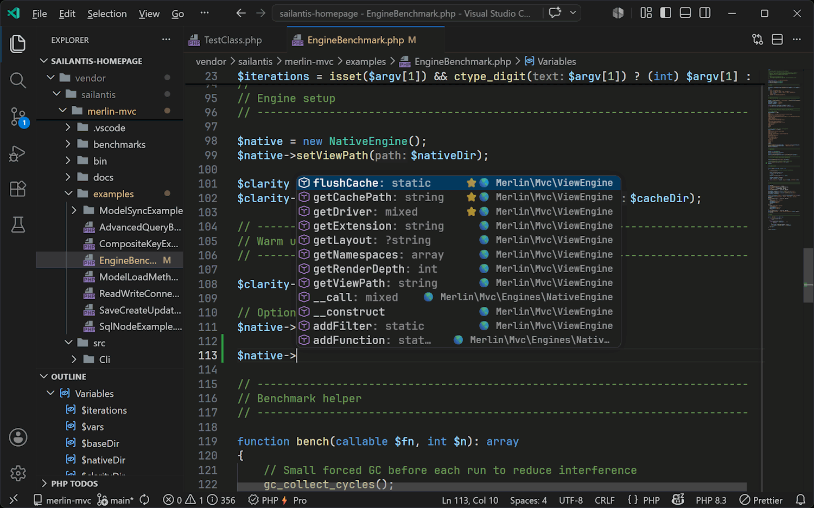
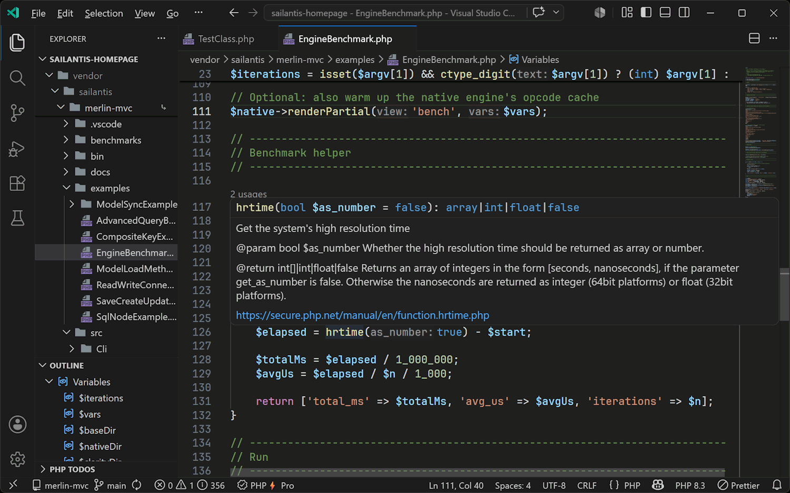
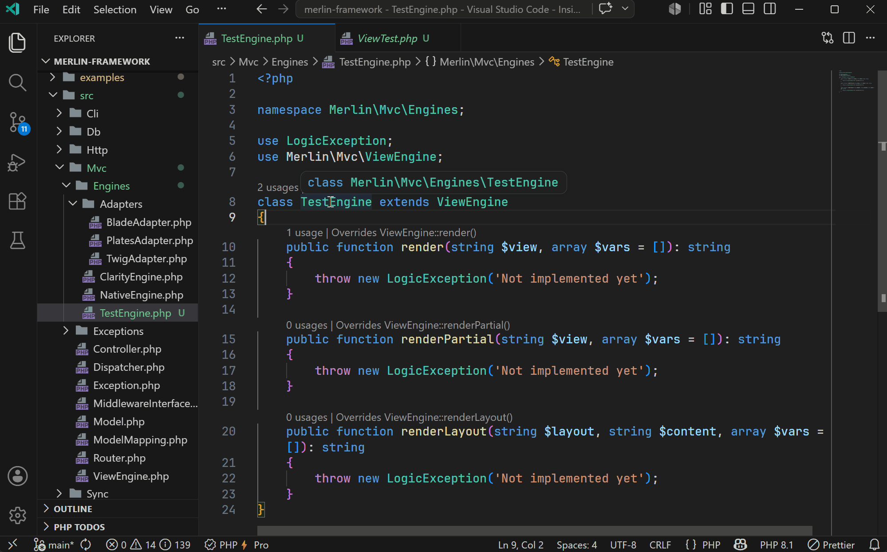
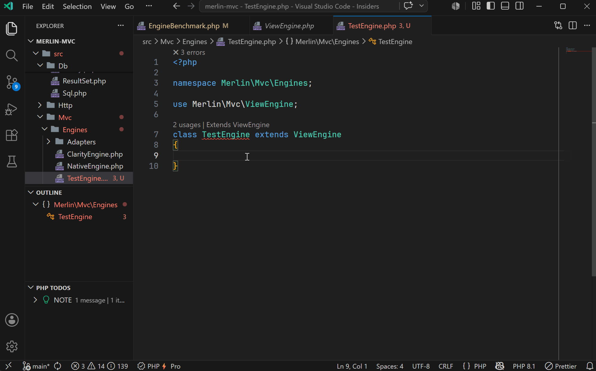
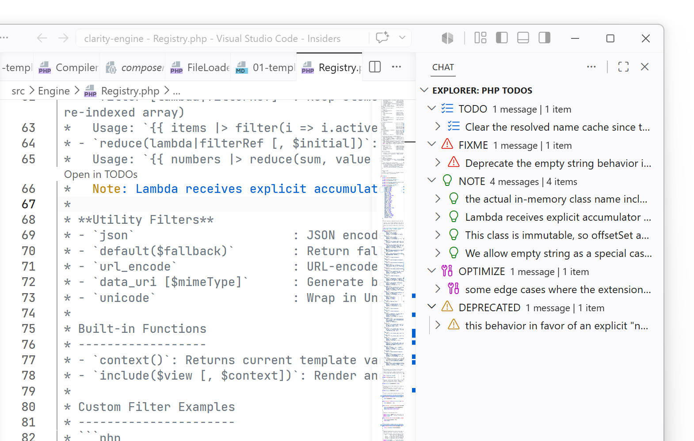

# Editor features

PhpThunder is first and foremost an editing toolchain. This page covers the workflows that matter during everyday PHP development — from the first keystroke to the final commit.

## At a glance

| Feature                      | What it does                                                                                         |
| ---------------------------- | ---------------------------------------------------------------------------------------------------- |
| Code intelligence            | Completion, hover, go-to-definition, find references, import suggestions, and PHPDoc-aware inference |
| Diagnostics                  | Parse errors, type problems, version mismatches, array-shape key issues, unused code                 |
| Quick fixes & source actions | Organize imports, generate PHPDoc, add use statements, remove dead code                              |
| Formatting                   | PSR-12 by default; EditorConfig and VS Code settings honored; Pro adds style customization           |
| TODO panel                   | Track and navigate `TODO`, `FIXME`, and similar comments project-wide                                |
| Composer helpers             | Run install, update, require, and dump-autoload from the command palette                             |

## Code intelligence

PhpThunder provides the core IDE behaviors expected in a well-equipped PHP workspace.

### Completion

As code is entered, PhpThunder suggests global symbols (classes, functions, constants), class members, static access, and namespaced identifiers. The suggestions include method signatures, property types, and PHPDoc summaries, keeping parameter names close at hand.

PhpThunder also understands PHPDoc templates, array shapes, callable signatures, dynamic return types, magic methods, fluent APIs, and local/imported type aliases. That extra context feeds higher-order inference, so member completion inside closures and arrow functions stays precise even when the variable type comes from a generic callback contract.

> **Example:** Start typing `new Http` in a Laravel project and PhpThunder completes to `Illuminate\Http\Request`, adding the `use` statement at the top of the file if it's not already there.

### Hover

Hover over any symbol to see its type signature, return type, parameters, and PHPDoc — including documentation from Composer dependencies. No need to leave the current file.

Hover also reflects alias-expanded PHPDoc types and inferred callback parameter types, so higher-order code keeps the same type detail as direct member access.

### Go to definition and find references

`F12` jumps to the definition of any symbol. `Shift+F12` (or right-click → Find All References) shows everywhere a symbol is used, across the entire project, including `vendor/` when vendor analysis is enabled.

### Import assistance

When a short class name cannot be resolved, PhpThunder offers to add the missing `use` statement. When multiple candidates exist (e.g., both `App\Request` and `Illuminate\Http\Request`), it shows a picker.

> **Tip:** `PhpThunder: Organize Imports` removes unused `use` statements and sorts the remaining ones. Bind it to a key or run it as a source action on save.

## Diagnostics and quick fixes

PhpThunder publishes diagnostics for:

- **Parse and syntax problems** — caught during typing, no save needed
- **Type analysis** — mismatched argument types, wrong return types, undefined properties
- **PHP version mismatches** — using PHP 8.1 named arguments in a project targeting 8.0
- **PHPDoc issues** — incorrect `@param` types, missing `@return` annotations, and alias-based type problems
- **Unused imports** — `use` statements that are never referenced in the file
- **Unused private members** — private properties and methods that are never accessed

Quick fixes and source actions are available from the lightbulb (💡) or via `Ctrl+.`:

- **Organize imports** — sort and remove unused `use` statements
- **Remove unused imports** — surgical removal without touching ordering
- **Remove unused private members** — clean up dead code in a class
- **Generate PHPDoc stub** — scaffold a `/** */` block for any method or property
- **Pick import candidate** — resolve ambiguous short names with a picker

> **Note:** Vendor file diagnostics are off by default to keep the noise level low. Enable `phpThunder.diagnostics.enableVendor: true` for full analysis of third-party code.

## Rename Symbol (Pro)

`F2` on any symbol triggers a workspace-wide rename that updates every reference: the declaration, all usages, and any qualified references in other files.

## Code generation (Pro)

PhpThunder can generate boilerplate:

- **Generate Getter / Setter** — creates accessor methods for properties, respecting the property type and PHPDoc
- **Generate missing accessors** — scans a class and offers to fill in any getters or setters that don't exist yet
- **Implement Missing Methods** — when a class declares an interface or extends an abstract class, PhpThunder generates stubs for all required methods

These are available as quick fixes (💡) directly on the class or property.

## Formatting

PhpThunder's formatter is always active and produces PSR-12-compliant output out of the box — no configuration required.

Standard VS Code editor settings and `.editorconfig` files are recognized in all tiers.

### EditorConfig

When an `.editorconfig` file is present, the formatter walks upward from the file being formatted, collects `.editorconfig` files (stopping at the first `root = true`), and applies the result. `.editorconfig` values take precedence over VS Code settings.

The recognized properties map directly to their VS Code equivalents:

| `.editorconfig` key        | VS Code equivalent             |
| -------------------------- | ------------------------------ |
| `indent_style`             | `editor.insertSpaces`          |
| `indent_size`              | `editor.tabSize`               |
| `tab_width`                | `editor.tabSize`               |
| `end_of_line`              | `files.eol`                    |
| `insert_final_newline`     | `files.insertFinalNewline`     |
| `trim_trailing_whitespace` | `files.trimTrailingWhitespace` |

Standard EditorConfig glob patterns are supported (`*`, `**`, `?`, character classes, alternation), including anchored patterns starting with `/`. Parsed files are cached and invalidated on change.

> **Tip:** Projects without an `.editorconfig` can configure the same options directly in `settings.json` at the workspace or folder level and get identical behavior.

### Style customization (Pro)

With a Pro license or active trial, additional style rules can be configured via `phpThunder.formatting.*`:

- **Arrays** — preserve, auto, force-single-line, or force-multi-line; also short-array vs array() bracket style
- **Parameters and arguments** — same four options for function/method definitions and call sites
- **Match arms** — formatting for `match` expressions (same four options)
- **Control structures** — `if`, `elseif`/`else`, `foreach`, `for`, `while`, `switch` — choose between brace-style or colon/alternative syntax
- **Max inline width** — the threshold at which `auto` mode breaks a single-line construct into multiple lines (default: 80)
- **Brace positions** — class, method, function, namespace, control-flow, and try/catch braces can each be placed on their own line or on the same line as the header
- **Spacing** — space after casts, inside/outside declaration and call parentheses, after commas, before `:` in return types
- **Trailing commas** — add or remove trailing commas in multi-line arrays and argument lists
- **Alignment** — align consecutive `=` assignments, `=>` arrows in arrays/match, inline comments, CSS declarations, and JS properties
- **Miscellaneous** — `else`/`elseif` on new line, `catch`/`finally` on new line, `case`/`default` indentation, empty body compactness, max consecutive blank lines, and more

See [Project configuration](07-project-configuration.md#formatting) for the full list of customization settings.

## TODO workflows

The TODO panel scans the codebase for comment markers (`TODO`, `FIXME`, etc.) and surfaces them in one place.

Key commands:

- `PhpThunder: Focus TODOs` — open the TODO panel
- `PhpThunder: Refresh TODOs` — rescan after bulk changes
- `PhpThunder: Filter TODOs` — narrow down by keyword or file
- `PhpThunder: Group TODOs` — switch between grouping by file, type, or priority

This is especially handy in larger codebases where TODOs scatter across dozens of files.

## Composer helpers

PhpThunder wraps common Composer operations for running them without leaving the editor:

- `PhpThunder: Composer Install`
- `PhpThunder: Composer Update`
- `PhpThunder: Composer Require Package`
- `PhpThunder: Composer Dump Autoload`
- `PhpThunder: Composer Validate`

Output from Composer appears in the PhpThunder output channel, where the changes are visible.

## Next steps

- [Debugging](04-debugging.md) — set up Xdebug and start debugging
- [Project configuration](07-project-configuration.md) — all formatting, diagnostic, and code-fix settings
- [Free vs Pro](08-free-vs-pro.md) — full breakdown of which features require a Pro license
- [Troubleshooting](09-troubleshooting.md) — if the editor state doesn't match the project
