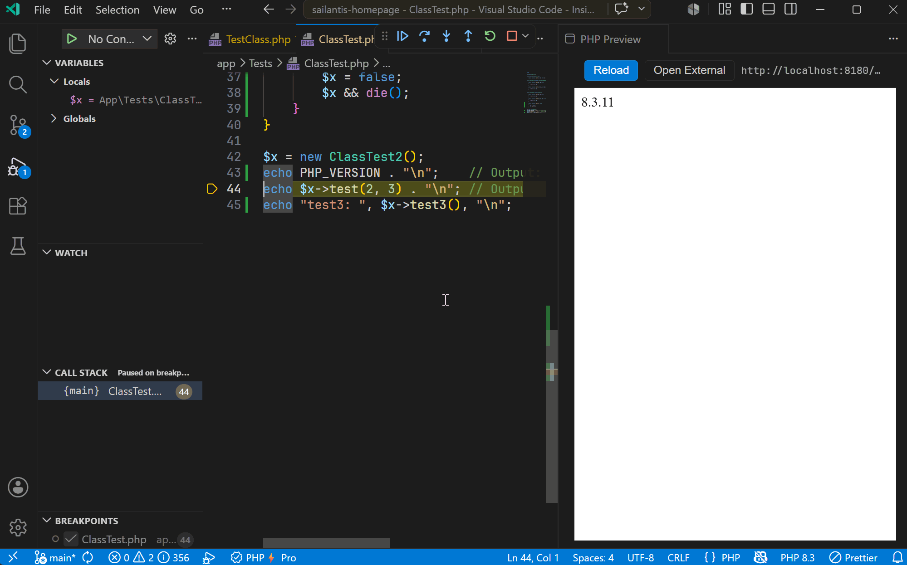

# Debugging

PhpThunder includes a full PHP debugger for VS Code, built on top of Xdebug. It handles the repetitive parts — finding the PHP binary, generating the right ini configuration, starting the server — while keeping the actual problem in focus.

Xdebug is the engine. PhpThunder wires it up, manages the connection, and shows breakpoints, call stacks, variable values, and (in Pro) inline values directly in the editor.

## Prerequisites

Required items:

- A PHP interpreter configured for the workspace (see [Installation and activation](02-installation-and-activation.md))
- Xdebug installed and enabled for that interpreter
- Port `9003` reachable from the PHP process (the default Xdebug port)

The debug type for all launch configurations is `phpThunder`.

> **Tip:** If Xdebug is missing, PhpThunder checks the selected interpreter when a debug session starts and reports the issue clearly.

## Three steps to the first breakpoint

1. Create a `launch.json` with a single `launch` configuration (see the example below).
2. Open a PHP file and click in the gutter to set a breakpoint.
3. Press `F5` — PhpThunder launches the script, connects to Xdebug, and pauses on the breakpoint.

That is the whole flow for local CLI scripts. Web and remote scenarios add a few more settings but follow the same idea.



## Debug modes

PhpThunder supports three workflows:

| Mode                        | Use case                                                    |
| --------------------------- | ----------------------------------------------------------- |
| `launch` with `mode: "cli"` | Run and debug a single PHP script directly                  |
| `launch` with `mode: "web"` | Start a local PHP web server and debug requests             |
| `attach`                    | Wait for an incoming Xdebug connection from any PHP process |

## Example launch.json

```json
{
  "version": "0.2.0",
  "configurations": [
    {
      // Debug the currently open PHP file as a CLI script
      "type": "phpThunder",
      "request": "launch",
      "name": "Launch PHP script",
      "program": "${file}",
      "cwd": "${workspaceFolder}",
      "port": 9003
    },
    {
      // Start a local web server and debug requests as they come in
      "type": "phpThunder",
      "request": "launch",
      "name": "PHP Web Server",
      "mode": "web",
      "cwd": "${workspaceFolder}",
      "port": 9003,
      "server": {
        "docRoot": "public", // document root relative to cwd
        "webPort": 8000, // local HTTP port
        "openBrowser": "ask" // "external", "webview", "ask", or false
      }
    },
    {
      // Wait for Xdebug to connect — useful for remote processes or containers
      "type": "phpThunder",
      "request": "attach",
      "name": "Attach to Xdebug",
      "hostname": "127.0.0.1",
      "port": 9003
    }
  ]
}
```

## Key launch fields

| Field           | What it does                                                                 |
| --------------- | ---------------------------------------------------------------------------- |
| `program`       | PHP script to run in CLI mode                                                |
| `args`          | Command-line arguments passed to the script                                  |
| `cwd`           | Working directory for the PHP process                                        |
| `env`           | Extra environment variables for the launched process                         |
| `phpBin`        | Override the workspace interpreter for this specific configuration           |
| `xdebugIniPath` | Path to a custom `php.ini` that loads Xdebug                                 |
| `generateIni`   | Let PhpThunder auto-generate `.vscode/phpThunder.ini` if Xdebug isn't loaded |
| `pathMappings`  | Map remote/container paths to local workspace paths                          |

## Web-mode server fields

When `mode` is `"web"`, the nested `server` object controls the local HTTP server:

| Field         | What it does                                    |
| ------------- | ----------------------------------------------- |
| `command`     | Override the auto-detected server start command |
| `docRoot`     | Document root, relative to `cwd`                |
| `router`      | Router script for frameworks that need one      |
| `urlPath`     | Request path to open after the server starts    |
| `webPort`     | Preferred HTTP port                             |
| `openBrowser` | `"external"`, `"webview"`, `"ask"`, or `false`  |

Web mode is a good fit for framework entry points, route testing, or any workflow where a browser request drives the execution path.

## Remote and container debugging

Use `attach` mode with `pathMappings` when PHP runs somewhere other than the local workspace — a Docker container, a remote VM, or a cloud dev environment.

```json
{
  "type": "phpThunder",
  "request": "attach",
  "name": "Attach to container",
  "hostname": "127.0.0.1",
  "port": 9003,
  "pathMappings": {
    "/var/www/html": "${workspaceFolder}"
  }
}
```

> **Common pitfall:** The keys in `pathMappings` are the _remote_ (container/server) paths, and the values are the _local_ (workspace) paths. Getting this backwards is the most common reason breakpoints appear to bind but then don't pause. Double-check the container's actual mount path if things don't pause as expected.

## Inline debug values (Pro)

With a Pro license, PhpThunder shows the current value of variables and expressions inline in the editor — right next to the code — while execution is paused. This makes it easier to understand the program state at a glance without switching to the Variables panel.

## A simple debug routine

1. Confirm the selected interpreter is the one the project actually uses.
2. Confirm Xdebug is loaded for that interpreter (`php -m | grep xdebug`).
3. Start with a minimal `launch` or `attach` configuration.
4. Set one or two breakpoints and press `F5`.
5. Add `pathMappings` or custom server options only if the simple setup isn't enough.

## Next steps

- [Profiling](05-profiling.md) — capture performance data without leaving VS Code
- [Troubleshooting](09-troubleshooting.md) — if breakpoints don't bind or connections never arrive
