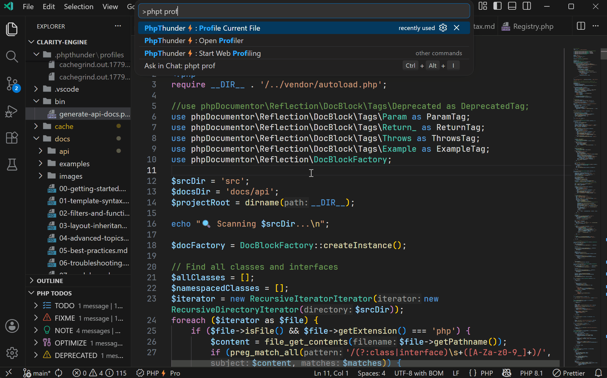

# Profiling

> **Pro feature:** Profiling requires Pro access or an active trial.

Performance problems are often invisible until they are not. A slow page load, a sluggish CLI command, or an API endpoint that takes much longer than expected tends to hide in the call stack rather than the obvious hot path. PhpThunder's profiler integrates directly with Xdebug's cachegrind output and a built-in panel, making it easier to find the slow line rather than just the slow request, without leaving VS Code.

## What is included

- Profile capture for CLI scripts (the currently open file)
- Web profiling with a local PHP server for request-driven workflows
- A profiler panel that lists collected captures and highlights call-time hotspots
- Persistent profile files under `.phpthunder/profiles/` with automatic `.gitignore` protection

## Requirements

- Pro access or an active trial
- A configured PHP interpreter for the workspace
- Xdebug loaded for that interpreter

If Xdebug is missing when a profiling session starts, PhpThunder stops early and reports which binary failed the check.

> **Tip:** The same Xdebug installation used for debugging works for profiling too. No extra configuration is required.

## Profile the current file

Use `PhpThunder: Profile Current File` for a quick CLI-style profile of whatever PHP file is active in the editor.

**Step-by-step:**

1. Open the PHP file to measure.
2. Run `PhpThunder: Profile Current File` from the command palette.
3. Wait for the script to complete — PhpThunder runs it with Xdebug profiling enabled.
4. When the run finishes, the profiler panel opens automatically with the new capture loaded.

PhpThunder writes a cachegrind file to `.phpthunder/profiles/` and opens the panel for inspection.



## Start web profiling

Use `PhpThunder: Start Web Profiling` when the code to measure runs in response to an HTTP request rather than as a standalone script. This is the right choice for:

- Framework entry points and controllers
- Routes that depend on HTTP context, sessions, or middleware
- Pages that are easier to exercise in a browser than via a single script call

**Step-by-step:**

1. Run `PhpThunder: Start Web Profiling` from the command palette.
2. PhpThunder checks Xdebug on the selected interpreter, then starts a local PHP server.
3. Open a browser and navigate to the page or endpoint to profile.
4. PhpThunder captures the cachegrind output for that request.
5. When finished, run `PhpThunder: Stop Web Profiling Server`.
6. Open the profiler panel with `PhpThunder: Open Profiler` to review the capture.

## Where profiles are stored

```text
.phpthunder/profiles/cachegrind.out.*
```

PhpThunder also creates a `.gitignore` in that folder automatically so profile artifacts don't sneak into version control.

## Profiling settings

| Setting                        | Default    | What it controls                                        |
| ------------------------------ | ---------- | ------------------------------------------------------- |
| `phpThunder.profiling.webPort` | `8190`     | HTTP port for the local web profiling server            |
| `phpThunder.profiling.docRoot` | `"public"` | Document root directory, relative to the workspace root |

Example:

```json
{
  "phpThunder.profiling.webPort": 8190,
  "phpThunder.profiling.docRoot": "public"
}
```

## Reviewing existing captures

A new capture is not required to use the panel. Run `PhpThunder: Open Profiler` at any time to reopen the panel and inspect saved cachegrind files. This is useful when:

- Previous captures are already available
- Multiple runs need to be compared side by side
- A long-running process was profiled and the output needs to be examined after the fact

## Troubleshooting checklist

- **No profile generated:** Confirm Xdebug is loaded for the selected interpreter (`php -m | grep xdebug`).
- **Web profiling fails to start:** Check that `phpThunder.profiling.docRoot` exists in the workspace and no other process is using the configured port.
- **Panel shows nothing:** Make sure cachegrind files exist in `.phpthunder/profiles/`. Run a fresh capture if the folder is empty.
- **Need more detail:** Open the `PHP Profiler` output channel for verbose log output from the profiling session.

## Next steps

- [Free vs Pro](08-free-vs-pro.md) — full breakdown of Pro features
- [Troubleshooting](09-troubleshooting.md) — if profiles are not generated or don't match the expected request
